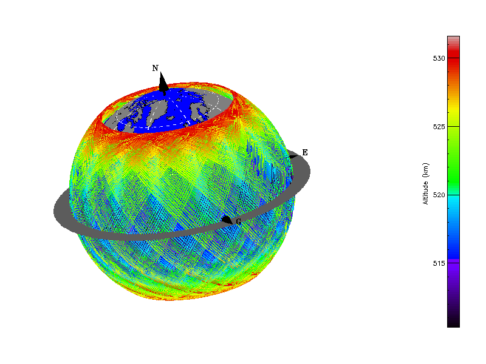
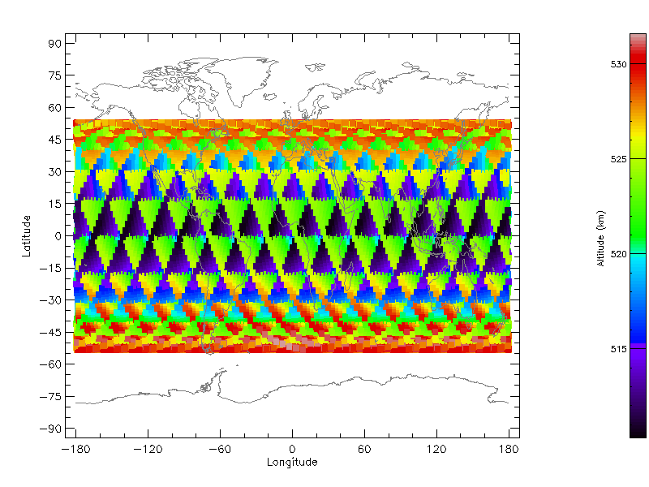
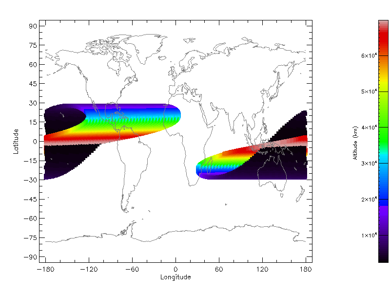
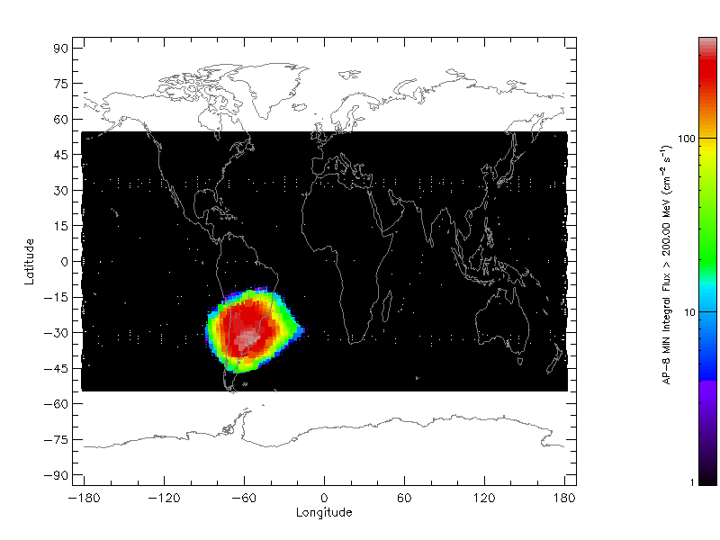
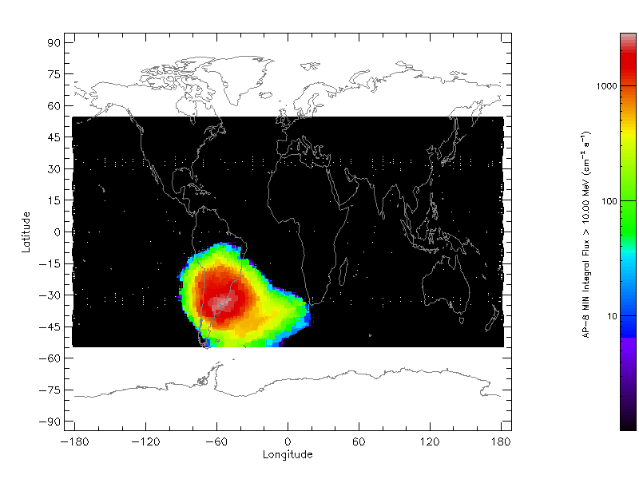
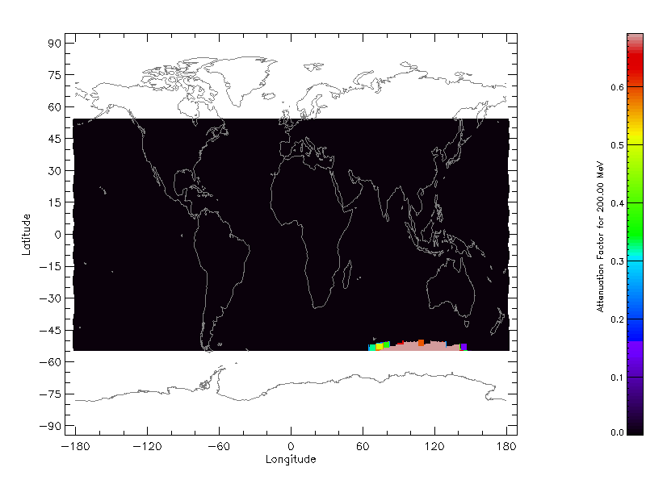
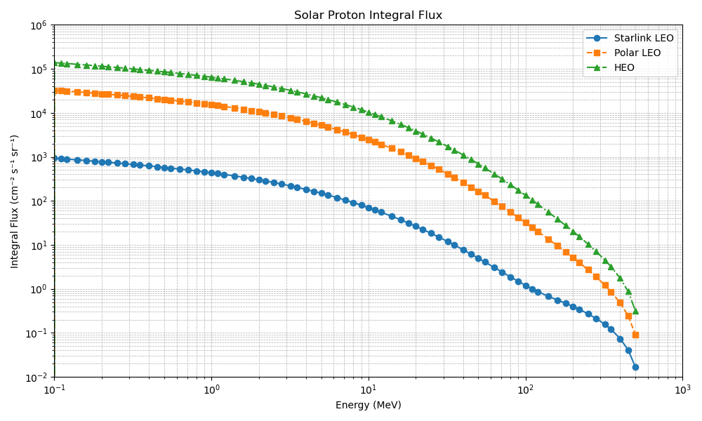
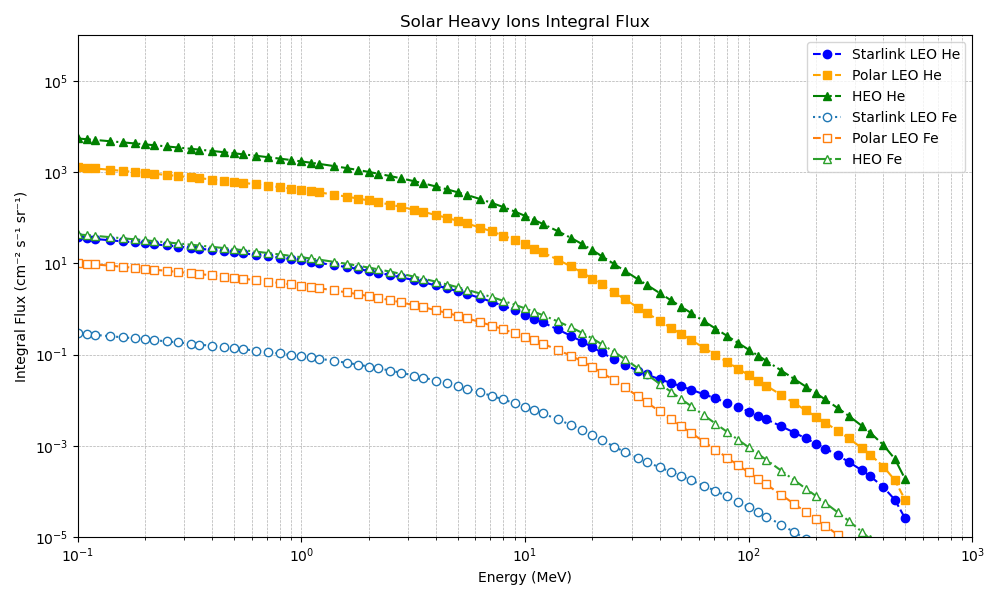
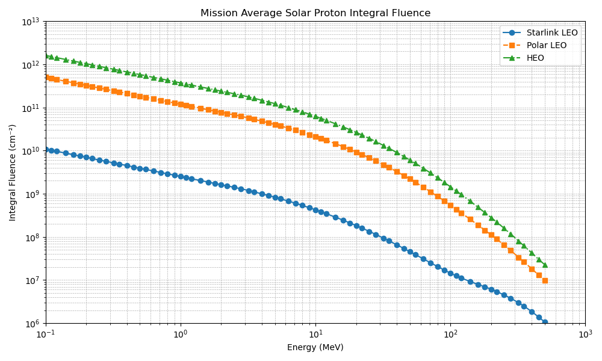
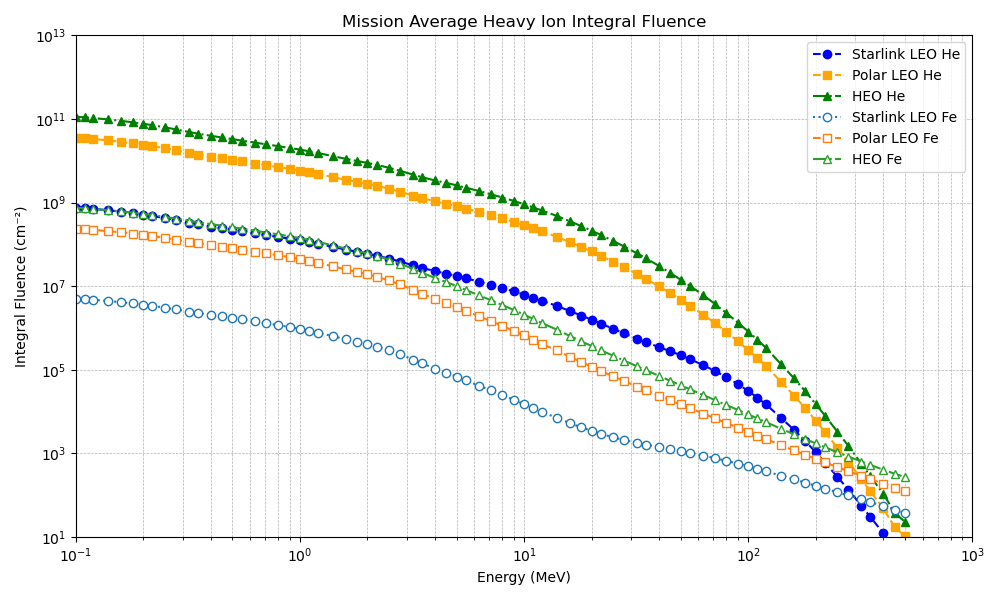

# me-radfx
IUB ENGR-E-399/599 ME Radiation Effects and Reliability
##  [HW 2](./HW_02.md): Modeling the Natural Space Radiation Environment -  SOLUTIONS 
### This assignment uses [SPENVIS](https://www.spenvis.oma.be)
### Flux and Fluence charts generated using [Jupyter (generate_spenvis_plots.ipynb)](./HW_02_Solutions/generate_spenvis_plots/generate_spenvis_plots.md)
1. Using SPENVIS, model the following orbits (assume a mission start date of Jan 1, 2026):

||Starlink Mid-Latitude LEO|Polar LEO (POES, IRIDIUM)|HEO (Van Allen Probes, MMS)|
|--|--|--|--|
|Mission Duration|2 years|7 Years|2 years|
|Apogee|530 km|825 km|70,000 km|
|Perigee|530 km|825 km|2,500 km|
|Inclination|53 deg|98.8 deg|28 deg|
|RAAN1|0 deg|0 deg|0 deg|
|Argument of Perigee|0 deg|0 deg|0 deg|
|True Anomaly|0 degs|0 deg|0 deg|

1Right Ascension of the Ascending Node

#### Orbit Models:
||[Starlink](./HW_02_Solutions/P1ex-orbit.html)|[Polar LEO](./HW_02_Solutions/P1A-orbit.html)|[HEO](./HW_02_Solutions/P1B-orbit.html)|
|--|--|--|--|
|3D View||||
|World Map View)||||

2. Use the following models:
	- Trapped Protons and Electronics: Standard AE-8 (solar max., 50% confidence level), AP-8 (solar min.)
	- CRÉME-96 solar particle model (Worst Day)
	- ESP-PHYCHIC solar particle model for total fluence (95% confidence level)
	- CRÉME-96 galactic cosmic ray model (solar min.)

#### Trapped Radiation Environment:
||Starlink|Polar LEO|HEO|
|--|--|--|--|
|World map of the trapped proton flux (for >200 MeV)||||
|World map of the trapped proton flux (for >10 MeV)||||

* Trapped proton integral flux spectrum (solar min): 

#### Solar Radiation Environment:
||Starlink|Polar LEO|HEO|
|--|--|--|--|
|World map of the 200 MeV solar proton attenuation factor||||

* Solar proton integral flux spectrum (worst day): 
* Solar heavy-ion integral flux spectrum (worst day): 
* Mission average solar proton fluence spectrum: 
* Mission average solar heavy-ion fluence spectrum: 

#### GCR Radiation Environment:
* GCR spectra: 

3. Name three differences in each of these orbits, as compared to the in-class example of a notional Starlink LEO orbit.
>* LEO (Polar):
>	- Similar, circular LEO orbit when compared to Starlink; however, the altitude is > 200km higher.
>	- As the inclination is greater, the orbit reaches ~30° higher latitudes compared to the Starlink LEO orbit.
>	- There is a larger concentration of trapped protons at all energies due to the higher altitude.
>* HEO:
>	- Smaller latitude deviation due to shallow inclination when compared to the example LEO orbit.
>	- Highly elliptical orbit with varying altitudes that travels through the Van Allen Belts, compared to the Starlink LEO circular orbit.
>	- There is a larger concentration of GCRs, solar, and trapped radiation when compared to both LEO orbits.

4. What is the integral flux of trapped protons of energy 1 MeV or greater?  What about for 200 MeV or greater?

> Examining the [Trapped proton integral flux spectrum (solar min)](#trapped-radiation-environment): 
> 
>****1 MeV or Greater (cm-2 s-1)****
>
>|Starlink|Polar LEO|HEO|
>|--|--|--|
>|~4x102|~2x104|~6x104|

****200 MeV or Greater (cm-2 s-1)****
>
>|Starlink|Polar LEO|HEO|
>|--|--|--|
>|~4x10-1|~5x100|~2x101|

5. For the life of each of these missions, how does the total fluence of solar protons of 200 MeV or greater to compare to the Starlink LEO mission?  _Provide the expected ratio (fluence of desired mission)/fluence of Starlink LEO._

> Examining the [Solar average mission fluence spectrum](#solar-radiation-environment): 
>
>****200 MeV or Greater (cm-2)****
>
>|Mission|Fluence|Ratio (fluence of desired mission/fluence of Starlink LEO)|
>|--|--|--|
>|Starlink|~6x106|1|
>|Polar LEO|~1x108|17|
>|HEO|~3x108|50|

6. Which mission sees the highest flux of GCR of Z=2 and higher?  How about Z=26 and higher? Why?
> Examining the [GCR integral flux spectrum](#GCR-Radiation-Environment): 
>
>* The HEO mission sees larger contributions for all GCR due to the elliptical orbit traversing beyond the magnetosphere.
>* However, for energies >103 MeV, the GCR fluxes tend to converge to the general relative ion abundance regardless of mission.

_Raw outputs for all models are located in_ [HW_02_Solutions](./HW_02_Solutions/) *and include:*
<small>
* [Starlink Orbit file](./HW_02_Solutions/P1ex-orbit.html)
* [Starlink world map of the trapped proton flux (for >200 MeV)](./HW_02_Solutions/P2ex-proton200MeV-worldmap.png)
* [Starlink world map of the trapped proton flux (for >10 MeV)](./HW_02_Solutions/P2ex-proton10MeV-worldmap.png)
* [Starlink world map of the 200 MeV solar proton attenuation factor](./HW_02_Solutions/P3ex-proton_sepflare_map-200MeV.png)
* [Polar LEO Orbit file](./HW_02_Solutions/P1A-orbit.html)
* [Polar LEO Trapped Particle Report](./HW_02_Solutions/P2A-Trapped-particle-fluxes.html)
* [Polar LEO Trapped Particle Flux](./HW_02_Solutions/P2A-protonfluxp_spec.png)
* [Polar LEO world map of the trapped proton flux (for >200 MeV)](./HW_02_Solutions/P2A-proton200MeV-worldmap.png)
* [Polar LEO world map of the trapped proton flux (for >10 MeV)](./HW_02_Solutions/P2A-proton10MeV-worldmap.png)
* [Polar LEO world map of the 200 MeV solar proton attenuation factor](./HW_02_Solutions/P3A-proton_sepflare_map-200MeV.png)
* [Polar LEO Solar Particle Report](./HW_02_Solutions/P3A-Solar-particle-fluxes.html)
* [Polar LEO Solar Proton Flux](./HW_02_Solutions/P3A-Solar-particle-flux-spectra.png)
* [Polar LEO Solar He Flux](./HW_02_Solutions/P3A-flarei_specHe.png)
* [Polar LEO Solar Fe Flux](./HW_02_Solutions/P3A-flarei_specFe.png)
* [Polar LEO Mission Average Fluence Report](./HW_02_Solutions/P3A-Solar-particle-fluences.html)
* [Polar LEO Solar Proton Fluence](./HW_02_Solutions/P3A-proton-fluences.png)
* [Polar LEO Solar He Fluence](./HW_02_Solutions/P3A-SolarHe-fluences.png)
* [Polar LEO Solar Fe Fluence](./HW_02_Solutions/P3A-SolarFe-fluences.png)
* [Polar LEO GCR Particle Report](./HW_02_Solutions/P4A-GCR.htm)
* [Polar LEO GCR Proton Flux](./HW_02_Solutions/P4A-GCR_H.png)
* [Polar LEO GCR He Flux](./HW_02_Solutions/P4A-GCR_He.png)
* [Polar LEO GCR Fe Flux](./HW_02_Solutions/P4A-GCR_Fe.png)
* [HEO Orbit file](./HW_02_Solutions/P1B-orbit.html)
* [HEO Trapped Particle Report](./HW_02_Solutions/P2B-Trapped-particle-fluxes.html)
* [HEO Trapped Particle Flux](./HW_02_Solutions/P2B-protonfluxp_spec.png)
* [HEO world map of the trapped proton flux (for >200 MeV)](./HW_02_Solutions/P2B-proton200MeV-worldmap.png)
* [HEO world map of the trapped proton flux (for >10 MeV)](./HW_02_Solutions/P2B-proton10MeV-worldmap.png)
* [HEO world map of the 200 MeV solar proton attenuation factor](./HW_02_Solutions/P3B-proton_sepflare_map-200MeV.png)
* [HEO Solar Particle Report](./HW_02_Solutions/P3B-Solar-particle-fluxes.html)
* [HEO Solar Proton Flux](./HW_02_Solutions/P3B-Solar-particle-flux-spectra.png)
* [HEO Solar He Flux](./HW_02_Solutions/P3B-flarei_specHe.png)
* [HEO Solar Fe Flux](./HW_02_Solutions/P3B-flarei_specFe.png)
* [HEO Mission Average Fluence Report](./HW_02_Solutions/P3B-Solar-particle-fluences.html)
* [HEO Solar Proton Fluence](./HW_02_Solutions/P3B-proton-fluences.png)
* [HEO Solar He Fluence](./HW_02_Solutions/P3B-SolarHe-fluences.png)
* [HEO Solar Fe Fluence](./HW_02_Solutions/P3B-SolarFe-fluences.png)
* [HEO GCR Particle Report](./HW_02_Solutions/P4B-GCR.htm)
* [HEO GCR Proton Flux](./HW_02_Solutions/P4B-GCR_H.png)
* [HEO GCR He Flux](./HW_02_Solutions/P4B-GCR_He.png)
* [HEO GCR Fe Flux](./HW_02_Solutions/P4B-GCR_Fe.png)
</small>