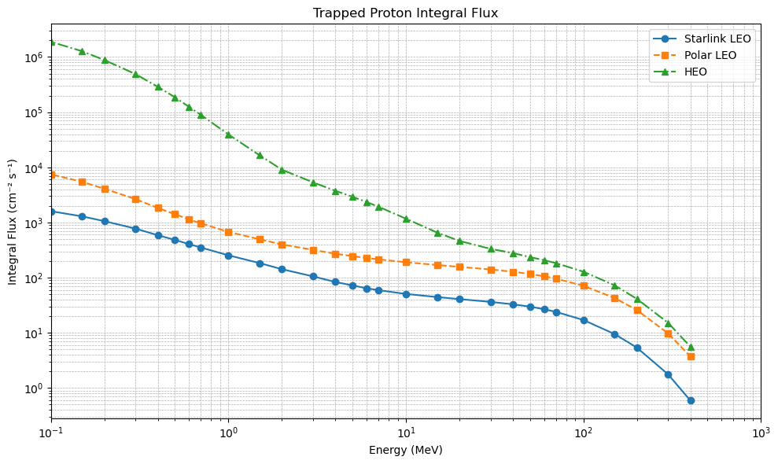
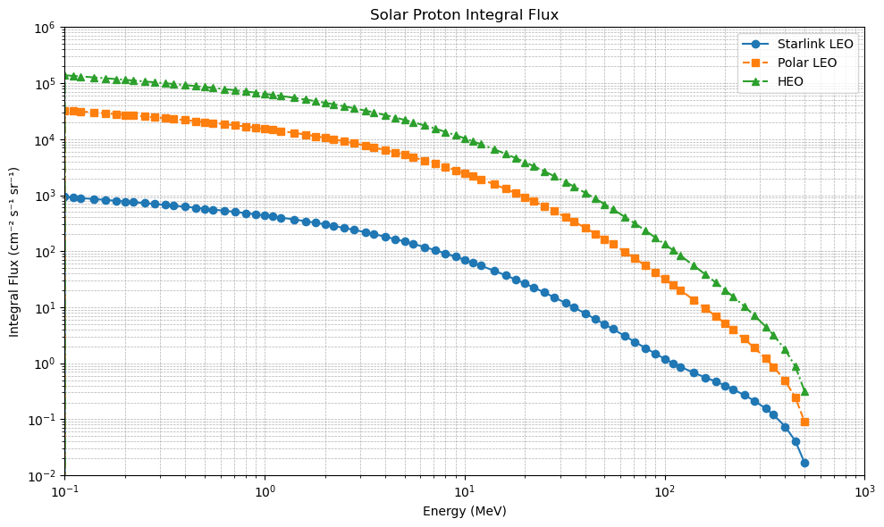
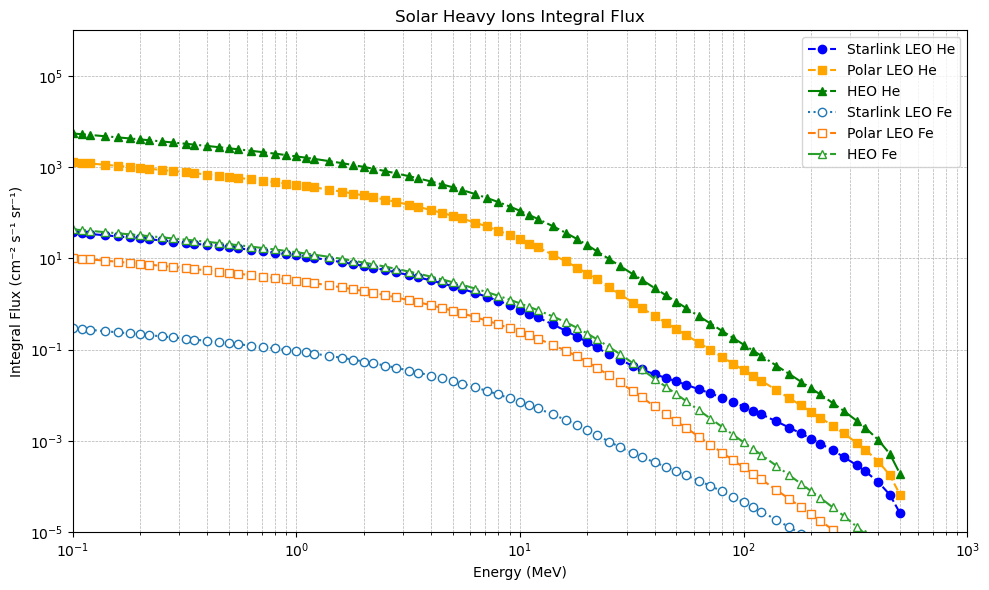
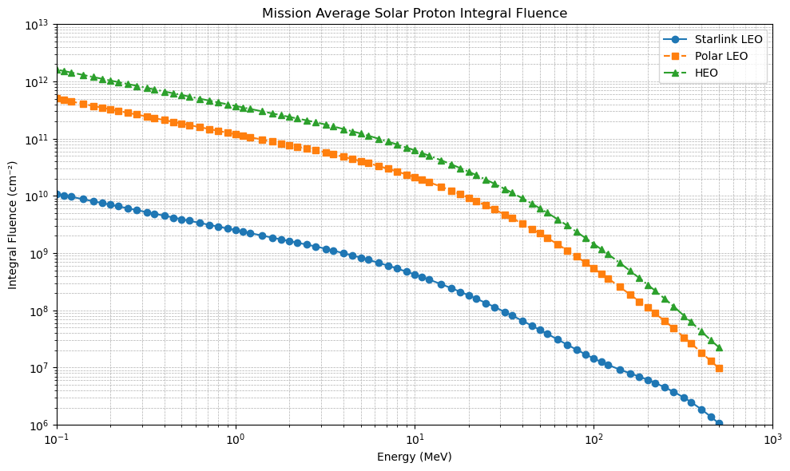
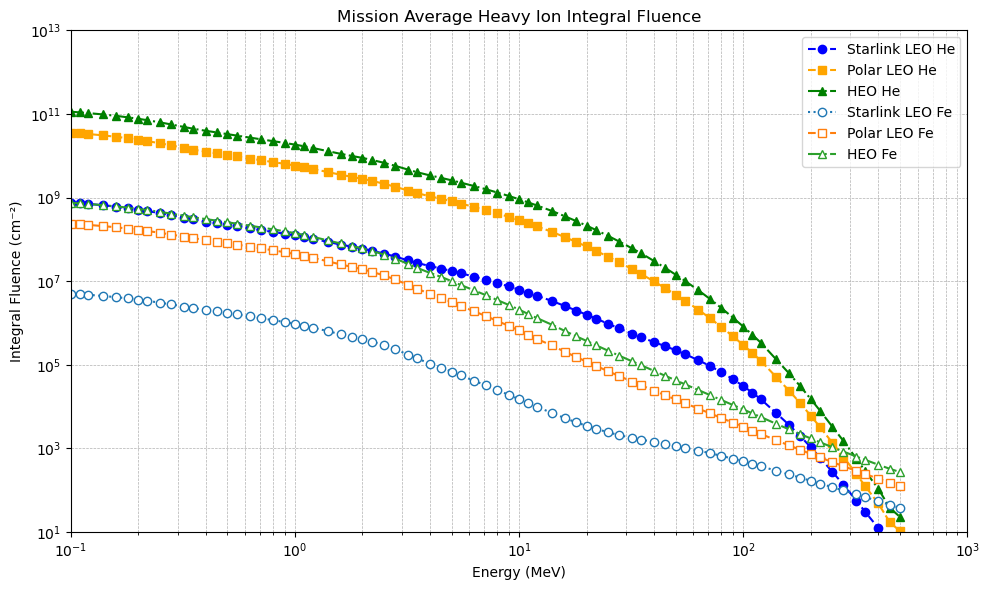

```python
import matplotlib.pyplot as plt
import numpy as np
```


```python
# Extract Proton Flux or Fluences from SPENVIS reports
# input: spenvis file
# output: energy as list and integral flux (or fluence) as list

def extract_proton_data(filename):
    energy = []
    iflux = []
    
    # Read the file and extract proton data
    with open(filename, 'r') as file:
        lines = file.readlines()
    # Flag to indicate if we are in the proton data block
    in_proton_block = False
    # Parse the lines to extract energy and IFlux values
    for line in lines:
        line = line.strip()
        if "'SPECIES', -1,'proton'" in line:
            in_proton_block = True
        elif "'SPECIES'," in line and in_proton_block:
            # Reached the next species block, stop reading proton data
            break
        elif in_proton_block:
            # Try to parse numeric data lines
            try:
                parts = [float(x) for x in line.split(",")]
                if len(parts) == 3 or len(parts) == 5:
                    energy.append(parts[0])
                    iflux.append(parts[1])
            except ValueError:
                continue
    return energy, iflux
```


```python
# Extract Heavy-Ion Flux or Fluences from SPENVIS reports
# input: spenvis file
# output: energy as list and integral flux (or fluence) for H, He, and Fe as lists
#
# note that this is currently hard-coded to report H, He, and Fe ions, but could be updated to be variable based on atomic number

def extract_hi_data(filename):
    energy = []
    iflux = []
    hflux = []
    heflux = []
    feflux = []
    
    # Read the file and extract ion data
    with open(filename, 'r') as file:
        lines = file.readlines()
    # Flag to indicate if we are in the proton data block
    in_hi_block = False
    in_proton_block = False
    # Parse the lines to extract energy and IFlux values
    for line in lines:
        line = line.strip()
        if "'PLT_HDR', -1,'CREME-96 (worst day): solar ions'" in line or "'PLT_HDR', -1,'ESP-PSYCHIC total fluence: solar ions'" in line:
            in_hi_block = True
        elif in_hi_block:
            # Try to parse numeric data lines (each part is an atomic number)
            try:
                parts = [float(x) for x in line.split(",")]
                if len(parts) == 185:
                    energy.append(parts[0])
                    hflux.append(parts[1])
                    heflux.append(parts[2])
                    feflux.append(parts[26])
            except ValueError:
                continue
    return energy, hflux, heflux, feflux
```


```python
# Extract Trapped Proton data from mission files
energy1, iflux1 = extract_proton_data("./HW_02_Solutions/starlink_spenvis_tri.txt")
energy2, iflux2 = extract_proton_data("./HW_02_Solutions/polar_leo_spenvis_tri.txt")
energy3, iflux3 = extract_proton_data("./HW_02_Solutions/heo_spenvis_tri.txt")
```


```python
# Plot the data using logarithmic scales
plt.figure(figsize=(10, 6))
plt.loglog(energy1, iflux1, marker='o', linestyle='-', label='Starlink LEO')
plt.loglog(energy2, iflux2, marker='s', linestyle='--', label='Polar LEO')
plt.loglog(energy3, iflux3, marker='^', linestyle='-.', label='HEO')
plt.xlim(0.1,1000)
plt.xlabel("Energy (MeV)")
plt.ylabel("Integral Flux (cm⁻² s⁻¹)")
plt.title("Trapped Proton Integral Flux")
plt.grid(True, which="both", ls="--", lw=0.5)
plt.legend()
plt.tight_layout()
plt.savefig("trapped_proton_integral_flux_loglog.png")
plt.show()
```


    

    


```python
# Extract Solar Proton data from mission files
energy1, iflux1 = extract_proton_data("./HW_02_Solutions/starlink_spenvis_sefflare.txt")
# convert m^-2 to cm^-2
newflux1 = [i * .0001 for i in iflux1]
energy2, iflux2 = extract_proton_data("./HW_02_Solutions/polar_leo_spenvis_sefflare.txt")
# convert m^-2 to cm^-2
newflux2 = [i * .0001 for i in iflux2]
energy3, iflux3 = extract_proton_data("./HW_02_Solutions/heo_spenvis_sefflare.txt")
# convert m^-2 to cm^-2
newflux3 = [i * .0001 for i in iflux3]
```


```python
# Plot the data using logarithmic scales
plt.figure(figsize=(10, 6))
plt.loglog(energy1, newflux1, marker='o', linestyle='-', label='Starlink LEO')
plt.loglog(energy2, newflux2, marker='s', linestyle='--', label='Polar LEO')
plt.loglog(energy3, newflux3, marker='^', linestyle='-.', label='HEO')
#plt.xscale('linear')
plt.xlim(1e-1,1e3)
plt.ylim(1e-2,1e6)
plt.xlabel("Energy (MeV)")
plt.ylabel("Integral Flux (cm⁻² s⁻¹ sr⁻¹)")
plt.title("Solar Proton Integral Flux")
plt.grid(True, which="both", ls="--", lw=0.5)
plt.legend()
plt.tight_layout()
plt.savefig("solar_proton_integral_flux_loglog.png")
plt.show()
```


    

    


```python
# Extract Solar Ion data from mission files
energy1, hflux1, heflux1, feflux1 = extract_hi_data("./HW_02_Solutions/starlink_spenvis_sefflare.txt")
energy2, hflux2, heflux2, feflux2 = extract_hi_data("./HW_02_Solutions/polar_leo_spenvis_sefflare.txt")
energy3, hflux3, heflux3, feflux3 = extract_hi_data("./HW_02_Solutions/heo_spenvis_sefflare.txt")
# convert m^-2 to cm^-2
newhflux1 = [i * .0001 for i in hflux1]
newhflux2 = [i * .0001 for i in hflux2]
newhflux3 = [i * .0001 for i in hflux3]
newheflux1 = [i * .0001 for i in heflux1]
newheflux2 = [i * .0001 for i in heflux2]
newheflux3 = [i * .0001 for i in heflux3]
newfeflux1 = [i * .0001 for i in feflux1]
newfeflux2 = [i * .0001 for i in feflux2]
newfeflux3 = [i * .0001 for i in feflux3]
#print(hflux1)
#print(hflux2)
```


```python
# Plot the data using logarithmic scales
plt.figure(figsize=(10, 6))
#plt.loglog(energy1, newhflux1, marker='o', color='tab:blue', linestyle='-', label='Starlink LEO H')
#plt.loglog(energy2, newhflux2, marker='s', color='tab:orange', linestyle='-', label='Polar LEO H')
#plt.loglog(energy3, newhflux3, marker='^', color='tab:green', linestyle='-.', label='HEO H')
plt.loglog(energy1, newheflux1, marker='o', color='blue', linestyle='--', label='Starlink LEO He')
plt.loglog(energy2, newheflux2, marker='s', color='orange', linestyle='--', label='Polar LEO He')
plt.loglog(energy3, newheflux3, marker='^', color='green', linestyle='-.', label='HEO He')
plt.loglog(energy1, newfeflux1, marker='o', color='tab:blue', mfc = 'w', linestyle=':', label='Starlink LEO Fe')
plt.loglog(energy2, newfeflux2, marker='s', color='tab:orange', mfc = 'w', linestyle='--', label='Polar LEO Fe')
plt.loglog(energy3, newfeflux3, marker='^', color='tab:green', mfc='w', linestyle='-.', label='HEO Fe')
plt.xlim(0.1,1000)
plt.ylim(1e-5,1e6)
plt.xlabel("Energy (MeV)")
plt.ylabel("Integral Flux (cm⁻² s⁻¹ sr⁻¹)")
plt.title("Solar Heavy Ions Integral Flux")
plt.grid(True, which="both", ls="--", lw=0.5)
plt.legend()
plt.tight_layout()
plt.savefig("solar_hi_integral_flux_loglog.png")
plt.show()
```


    

    


```python
# Extract Solar Proton Fluence data from mission files
energy1, iflux1 = extract_proton_data("./HW_02_Solutions/starlink_spenvis_sef.txt")
energy2, iflux2 = extract_proton_data("./HW_02_Solutions/polar_leo_spenvis_sef.txt")
energy3, iflux3 = extract_proton_data("./HW_02_Solutions/heo_spenvis_sef.txt")
```


```python
# Plot the data using logarithmic scales
plt.figure(figsize=(10, 6))
plt.loglog(energy1, iflux1, marker='o', linestyle='-', label='Starlink LEO')
plt.loglog(energy2, iflux2, marker='s', linestyle='--', label='Polar LEO')
plt.loglog(energy3, iflux3, marker='^', linestyle='-.', label='HEO')
#plt.xscale('linear')
plt.xlim(0.1,1e3)
plt.ylim(1e6,1e13)
plt.xlabel("Energy (MeV)")
plt.ylabel("Integral Fluence (cm⁻²)")
plt.title("Mission Average Solar Proton Integral Fluence")
plt.grid(True, which="both", ls="--", lw=0.5)
plt.legend()
plt.tight_layout()
plt.savefig("solar_proton_integral_fluence_loglog.png")
plt.show()
```


    

    


```python
# Extract Solar Ion Fluence data from mission files
energy1, hflux1, heflux1, feflux1 = extract_hi_data("./HW_02_Solutions/starlink_spenvis_sef.txt")
energy2, hflux2, heflux2, feflux2 = extract_hi_data("./HW_02_Solutions/polar_leo_spenvis_sef.txt")
energy3, hflux3, heflux3, feflux3 = extract_hi_data("./HW_02_Solutions/heo_spenvis_sef.txt")
```


```python
# Plot the data using logarithmic scales
plt.figure(figsize=(10, 6))
#plt.loglog(energy1, hflux1, marker='o', color='tab:blue', linestyle='-', label='Starlink LEO H')
#plt.loglog(energy2, hflux2, marker='s', color='tab:orange', linestyle='-', label='Polar LEO H')
#plt.loglog(energy3, hflux3, marker='^', color='tab:green', linestyle='-.', label='HEO H')
plt.loglog(energy1, heflux1, marker='o', color='blue', linestyle='--', label='Starlink LEO He')
plt.loglog(energy2, heflux2, marker='s', color='orange', linestyle='--', label='Polar LEO He')
plt.loglog(energy3, heflux3, marker='^', color='green', linestyle='-.', label='HEO He')
plt.loglog(energy1, feflux1, marker='o', color='tab:blue', mfc = 'w', linestyle=':', label='Starlink LEO Fe')
plt.loglog(energy2, feflux2, marker='s', color='tab:orange', mfc = 'w', linestyle='--', label='Polar LEO Fe')
plt.loglog(energy3, feflux3, marker='^', color='tab:green', mfc='w', linestyle='-.', label='HEO Fe')
plt.xlim(0.1,1e3)
plt.ylim(1e1,1e13)
plt.xlabel("Energy (MeV)")
plt.ylabel("Integral Fluence (cm⁻²)")
plt.title("Mission Average Heavy Ion Integral Fluence")
plt.grid(True, which="both", ls="--", lw=0.5)
plt.legend()
plt.tight_layout()
plt.savefig("solar_hi_integral_fluence_loglog.png")
plt.show()
```


    

    


```python

```
